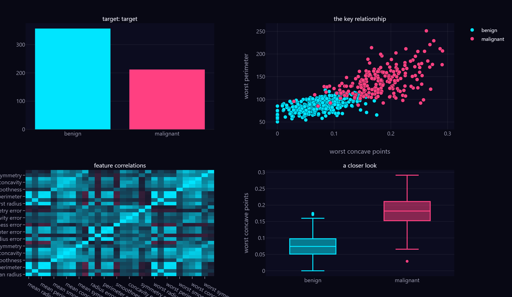
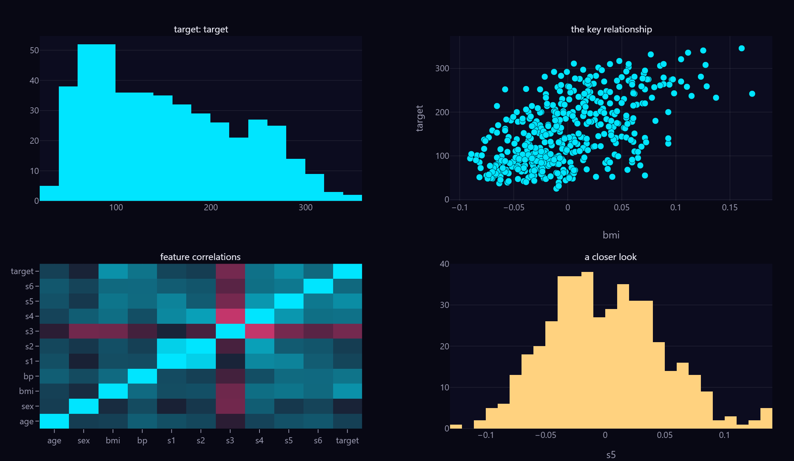
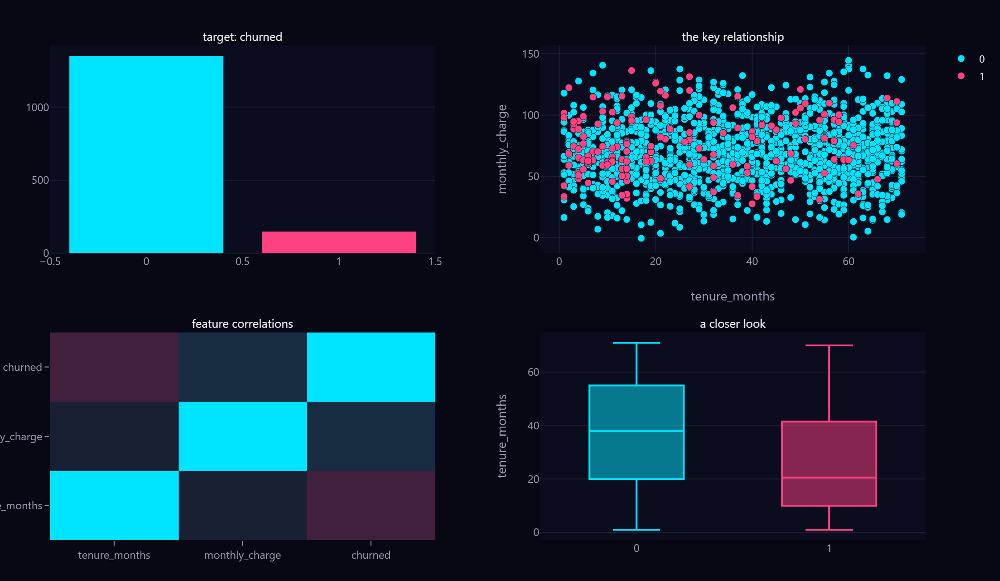

# firstlook in action

`firstlook.at(df, target=...)` takes a raw dataframe and hands back, in one call: the **problem type**, **models worth trying** (with reasons and data-quality warnings), the **right charts**, and a **cross-validated baseline score**.

The full walkthrough — old way vs one line — is in [`showcase.ipynb`](showcase.ipynb). The highlights:

## One call, three real datasets

### Breast cancer — classification · 569 × 30

```python
firstlook.at(bc, target="target", fit=True)
```

classification · start `LogisticRegression` · **baseline accuracy 0.98** (5-fold CV)



No column was named for it — firstlook surfaced `worst concave points` and `worst perimeter`, the two features that actually separate malignant from benign, on its own.

### Diabetes — regression · 442 × 10

```python
firstlook.at(db, target="target", fit=True)
```

regression · start `LinearRegression` · **baseline R² 0.48** (5-fold CV)



An honest R². Diabetes progression is genuinely hard to predict from these features, and firstlook tells you that instead of inflating it.

### Customer churn — messy & imbalanced · 1,500 rows, categorical + missing

```python
firstlook.at(churn, target="churned", fit=True)
```

classification · **balanced accuracy 0.69** (5-fold CV) · flagged: 90/10 imbalance, a categorical column to encode, missing values



The hard case, and where it earns its keep. firstlook caught the imbalance, the categorical `plan` column, and the missing values; weighted the classes and scored with **balanced accuracy** (0.69 — real signal found) instead of the flattering ~0.90 plain accuracy a majority-only guesser would post. Impute, scale, and one-hot all happened inside the fit.

## What it replaces

The opening of every project — `df.info()`, a grid of histograms, "is this classification or regression?", digging up the sklearn cheat-sheet, scaling the features, picking a metric, writing the cross-validation loop — collapses into one line. The notebook puts the two side by side.

## Run it

```bash
pip install -e ".[dev]"               # from the repo root
python examples/build_showcase.py     # regenerates the notebook + this gallery
```

Open the interactive dashboards in a browser: [breast_cancer.html](breast_cancer.html) · [diabetes.html](diabetes.html) · [churn.html](churn.html)
